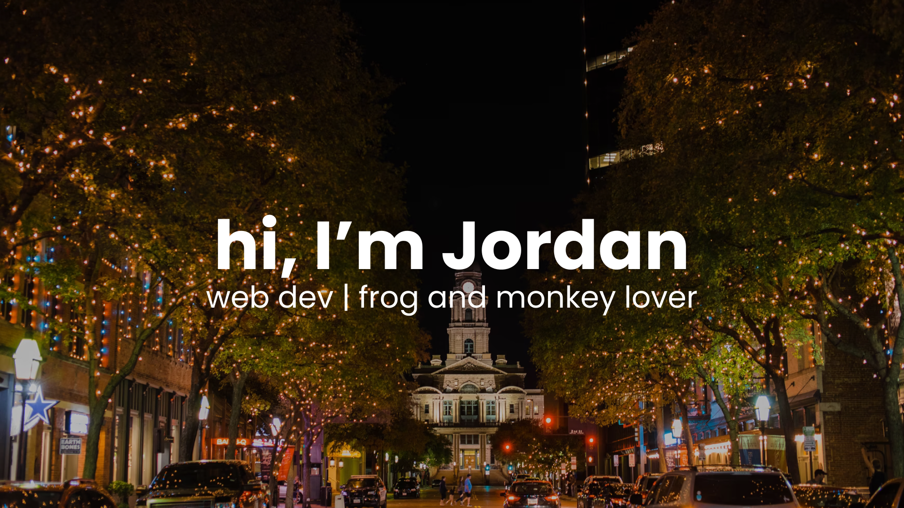

## 👋 Hi there
I'm Jordan (he/him), a 18 year-old web developer from Virginia. I've been interested in technology for most of my life and I've been coding since I was 12. Currently, I'm learning data structures & algorithms among many other things while I apply for my first job.

## 👨‍💻 Skills

## 🎓 Certifications & Education
- Graduated from Nelson County High School (VA) 2017-2021

-  (I got this when I was 13 but never claimed the certificate 😭)
